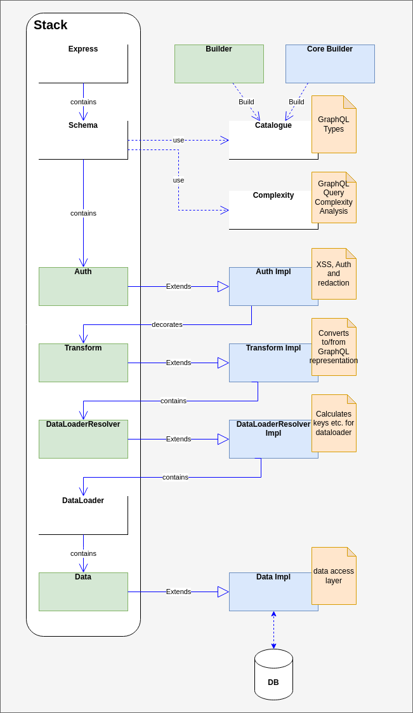

# MetaData

MetaData is a code-generation system that takes a single XML file describing a data model (entities
and their relationships) and generates a complete backend application, consisting of a database
and a GraphQL interface to that database. The code generation system is written in Python, and
in the first instance the generated database is SQLite and the generated GraphQL stack is node js.

> I'd wanted to rename this project "Marmite" because firstly code-generation is a very polarising
subject, people tend to either love it or hate it, and secondly the templates in particular
are very information-rich. However I'd probably run into issues using a likely proprietary name
so MetaData will have to do.

## Build the Code Generator

On Unix/Linux, clone the repo, then in the root directory do

```commandline
python --version # requires 3.x
virtualenv --python=pythonX.Y `pwd`/venv # use the python version output from the previous command
pip install -r requirements.txt
```

## Generate the Demo Application

The provided [demo/schema.xml](demo/schema.xml) shows how to declare entities and their
relationships, and the sample target application can be generated by:

```commandline
python3 main.py --schema demo/schema.xml \
                --output demo/out \
                --architecture sqlite-node-graphql \
                --extra demo
```

This will create the directory `demo/out` if it doesn't exist and populate it with the generated
application.

Note that the argument to `--architecture` is just the name of a directory under `./architectures`
containing appropriate templates. The intention is to support more architectures in the future.

The `--extra` argument specifies a base directory in which there should be another `architectures`
directory with equivalent architecture subdirectories, i.e. in this example
`demo/architectures/sqlite-node-graphql`. That directory can supply override templates for the
templates in the base architectures directory, allowing individual applications the ability
to customize core behaviour if needed.

If you're intending to use authentication, as the demo does, you will also need to generate a `.env`
file inside the architecture source, containing access and refresh token secrets. This file is
ignored by git and since it is generated once in the source, the secrets won't change and
invalidate all your access and refresh tokens every time you run the build. You can conveniently
generate this file with:

```commandline
python3 main.py --architecture sqlite-node-graphql --generate-dotenv
```

which will create `./architectures/sqlite-node-graphql/.env`, from where a subsequent build will
copy it to the target directory.

## Run the Generated Application

To actually run the generated application:

```commandline
cd demo/out
npm install     # first time - install node js dependencies
npm run init-db # first time - creates the empty database, subsequently it will empty the
                # database (your choice)
npm run dev     # run the application on http://localhost:4000/graphql
```

If you have authentication turned on (the demo does,) after starting the above, in a separate
terminal you must also run:

```commandline
cd demo/out
npm run dev-auth
```

### Tests

tests are generated for the demo application, to run them:

```commandline
cd demo/out
npm run test
```

This is also useful because it will populate the database.

### Telemetry

If you'd like to see opentelemetry traces, install and run
[Jaeger](https://www.jaegertracing.io/docs/1.41/getting-started/).
The application will export telemetry to Jaeger if available.

## Postman

For convenience during manual testing, I've added a couple of Postman files under `demo/Postman`,
specifically an environment
and a collection. The environment just defines hostname, port, access tokens &c. The collection
contains folders for Auth and GraphQL. The Auth folder contains queries for sign-up, login, logout
and access token refresh. Tests associated with those auth requests will populate the environment
with current access and refresh tokens &c. which the GraphQL requests then use.

## Structure of the Builder Application

### Architectures

The directory structure under individual architectures is completely free form and is replicated to
the directory specified by the `--output` argument to the builder. The templates are processed using
[jinja2](https://palletsprojects.com/p/jinja/). Files with a `.j2` suffix are considered jinja
templates and are processed to the equivalent output file with the `.j2` suffix stripped.
Normally files are processed passing in a top-level `schema` object representing the entire
application specification, however `.j2` files with a `%E` embedded in their name are instead
processed repeatedly for each `entity` in the schema, and written to separate files with the
`%E` replaced by each entity name. Likewise '.j2' files with a `%A` in their name are processed for
each
association in the schema, with the `%A` replaced by the association name in each output file.
Files with a `.j2h` suffix are considered macros for internal use by the templates and are not
copied to the output directory.
Files without a `.j2` or `.j2h` suffix are copied to the output verbatim.

### Semantics

The mistake often made with code generation is to parse some XML to a basic DOM then pass that
directly to the templates. That requires the templates to do an awful lot of work just to get at
the data they require. Instead this application further processes the parsed XML into a highly
self-referential graph of semantic objects which have high-level methods like
`schema.get_entities()` and `entity.get_fields()` making the maintenance of the templates much
more practical.

## Specific Generated Architecture

The architecture of the generated application, at least the `sqlite-node-graphql` example,
is deliberately vanilla, a single GraphQL schema, assorted middleware, and an SQLite back-end
as follows:



The `Auth`, `Transform`, `DataLoaderResolver` and `Data` classes in the diagram are empty and
merely extend their respective implementation classes, the intention being that developers can
provide override templates for those empty classes in which they can can then override or add
methods.

Likewise the `Builder` and `Core Builder` packages both export a function `build`, that takes
a `Catalogue` object (pluss the downstream middleware), adds GraphQL types, queries and mutations
to the catalogue, and returns the resulting
catalogue. The `Core Builder` adds the core types specified in the XML schema, whereas the `Builder`
package is a no-op that returns its argument unchanged and can be overridden.

## TODO

Lots, but specifically

### general
* support business logic
  * custom filters and transforms (spec done, see [dev-notes](dev-notes.md))
  * custom queries and mutations
  * local template overrides - done
* think about how to share templates across architectures - later (see [dev-notes](dev-notes.md))
* think about using the null object pattern for redacted and/or missing data
* enumerations - done
* more data types (date, money, boolean, e-mail &c.)
* consider a Semantics.Type class to encapsulate the types of fields
* add another demo with a very different use case (retail?)
* add another architecture (php-mysql-rest?)

### sqlite-node-graphql architecture specific
* tests (generated) - in progress
* auth - in progress
  * see [Auth](auth.md) for specific scenarios
* deferred data retrieval with dataloader - done
  * dataloader cache management - done
* pagination - done
* mutation - done
* OpenTracing or OpenTelemetry metrics - done
* Security
  * review XSS vulnerabilities
    * add `security="xss"` schema attribute to globally enable html escaping of text input - done
  * review SQL injection vulnerabilities - *should* be ok, all db queries use parameters.
  * add graphql-query-complexity analysis and rejection - done
  * move to https with a local certificate
  * consider merging the Security and Auth transforms - done
* with the proliferation of potential extra servers (Redis, Jaeger, other databases etc.)
consider moving to containers for testing and deployment. Evaluate the pros and cons of
  * Docker
  * Vagrant
  * Kubernites

### demo-specific
* demonstrate the use of middleware to handle linkedin-style friend requests
* Redis for push notifications?
