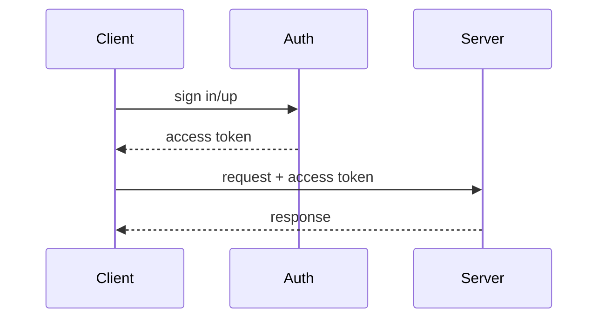

# AUTH

```mermaid
sequenceDiagram
participant Client
participant Auth
participant Server
Client->>Auth: sign in/up
Auth-->>Client: access token
Client->>Server: request + access token
Server-->>Client: response
```