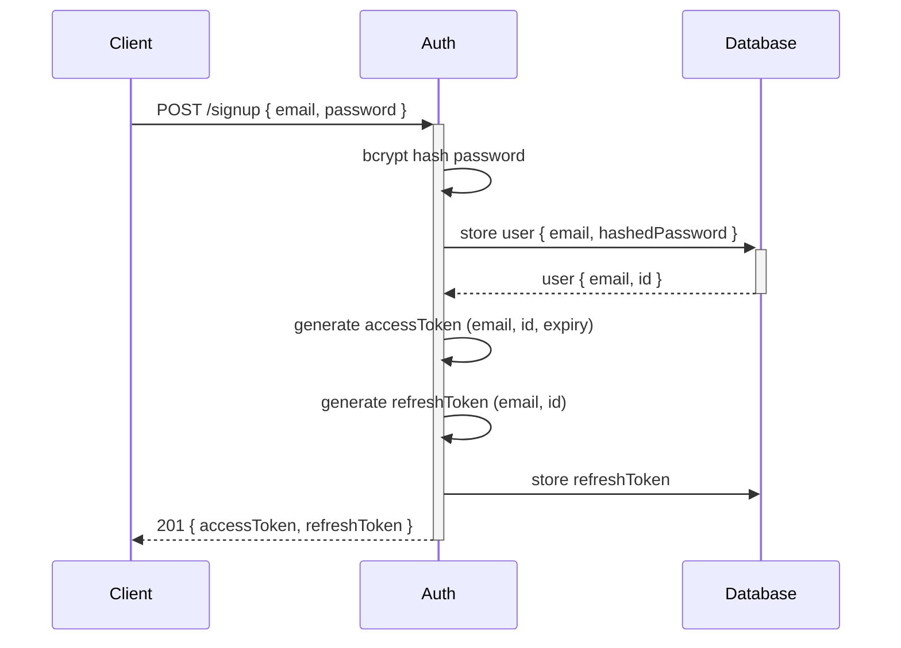
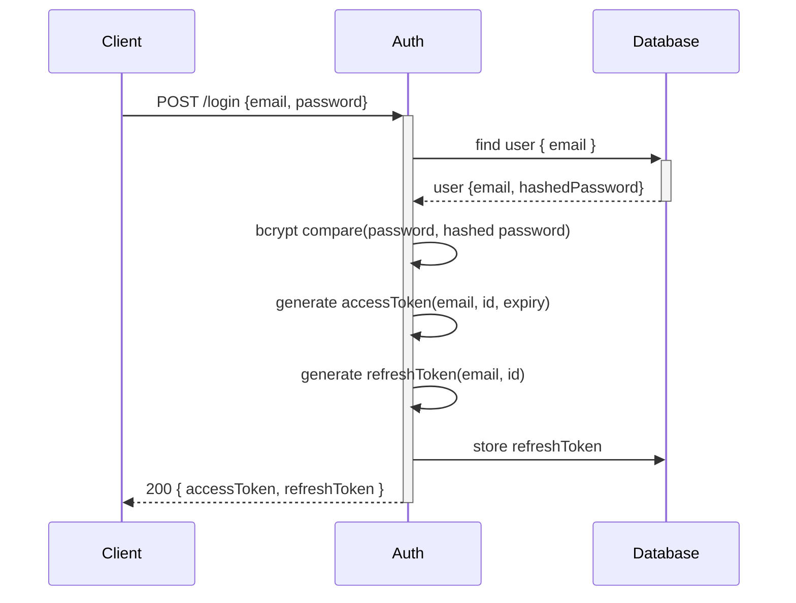
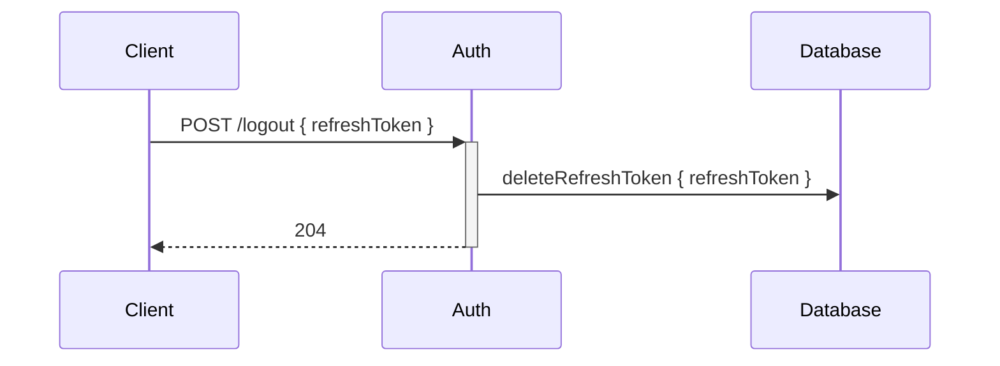
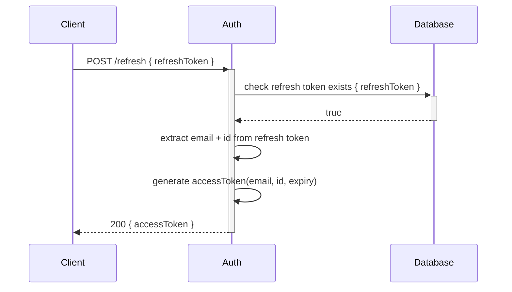
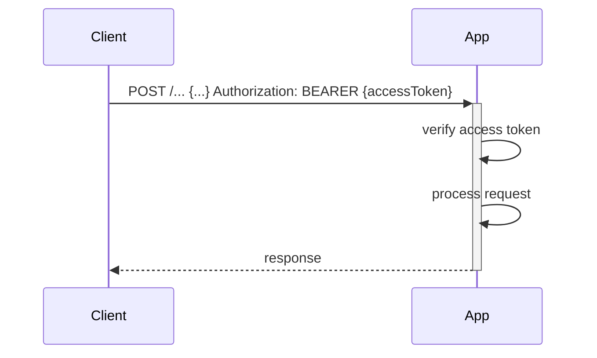
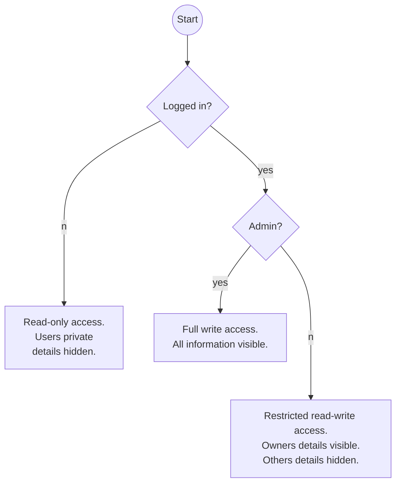

# AUTH

## Auth Server Endpionts
### Sign Up

```mermaid
sequenceDiagram
participant Client
participant Auth
participant Database

Client->>+Auth: POST /signup { email, password }
    Auth->>Auth: bcrypt hash password
    Auth->>+Database: store user { email, hashedPassword }
    Database-->>-Auth: user { email, id }
    Auth->>Auth: generate accessToken (email, id, expiry)
    Auth->>Auth: generate refreshToken (email, id)
    Auth->>Database: store refreshToken
Auth-->>-Client: 201 { accessToken, refreshToken }
```

### Log In

```mermaid
sequenceDiagram
participant Client
participant Auth
participant Database

Client->>+Auth: POST /login {email, password}
    Auth->>+Database: find user { email }
    Database-->>-Auth: user {email, hashedPassword}
    Auth->>Auth: bcrypt compare(password, hashed password)
    Auth->>Auth: generate accessToken(email, id, expiry)
    Auth->>Auth: generate refreshToken(email, id)
    Auth->>Database: store refreshToken
Auth-->>-Client: 200 { accessToken, refreshToken }
```

### Log Out

```mermaid
sequenceDiagram
participant Client
participant Auth
participant Database

Client->>+Auth: POST /logout { refreshToken }
    Auth->>Database: deleteRefreshToken { refreshToken }
Auth-->>-Client: 204
```

### Refresh

```mermaid
sequenceDiagram
participant Client
participant Auth
participant Database

Client->>+Auth: POST /refresh { refreshToken }
    Auth->>+Database: check refresh token exists { refreshToken }
    Database-->>-Auth: true
    Auth->>Auth: extract email + id from refresh token
    Auth->>Auth: generate accessToken(email, id, expiry)
Auth-->>-Client: 200 { accessToken }
```

## Application Endpoint

```mermaid
sequenceDiagram
participant Client
participant App
Client->>+App: POST /... {...} Authorization: BEARER {accessToken}
App->>App: verify access token
App->>App: process request
App-->>-Client: response
```

## Roles

```mermaid
flowchart TD
start(( Start ))-->loggedin{ Logged in? }
loggedin--no-->readonly[Read-only access.\nUsers private\ndetails hidden.]
loggedin--yes-->admin{ Admin? }
admin--no-->normal[Restricted read-write access.\nOwners details visible.\nOthers details hidden.]
admin--yes-->full[Full write access.\nAll information visible.]
```

