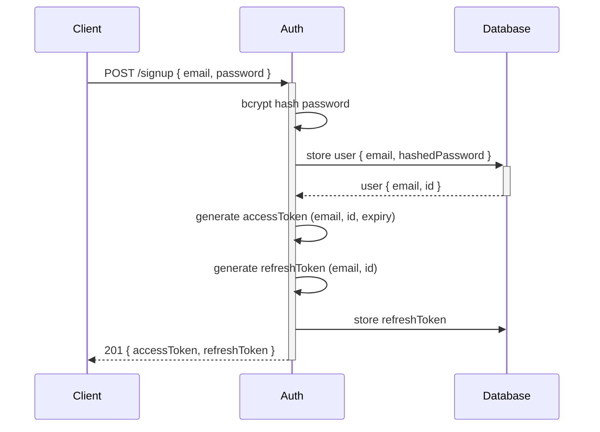
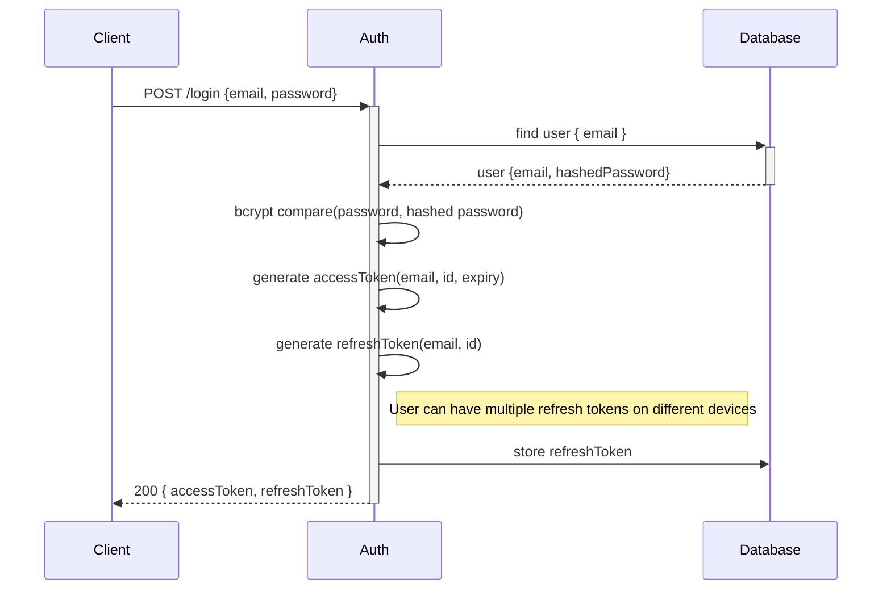
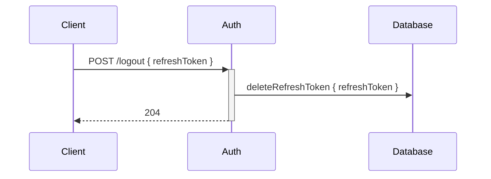
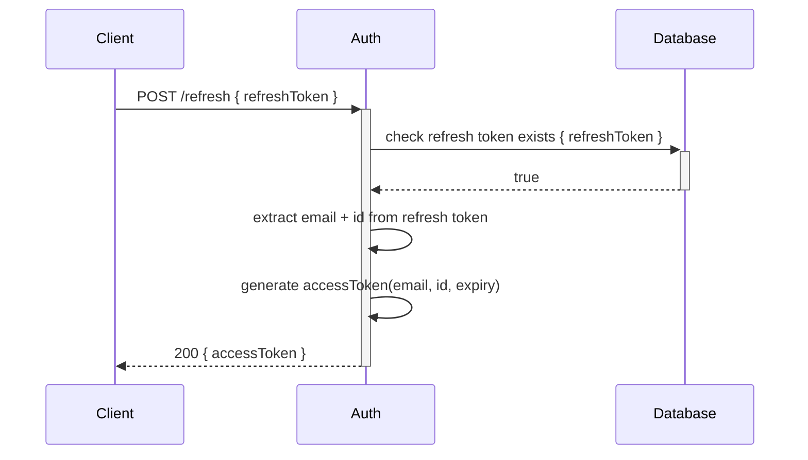
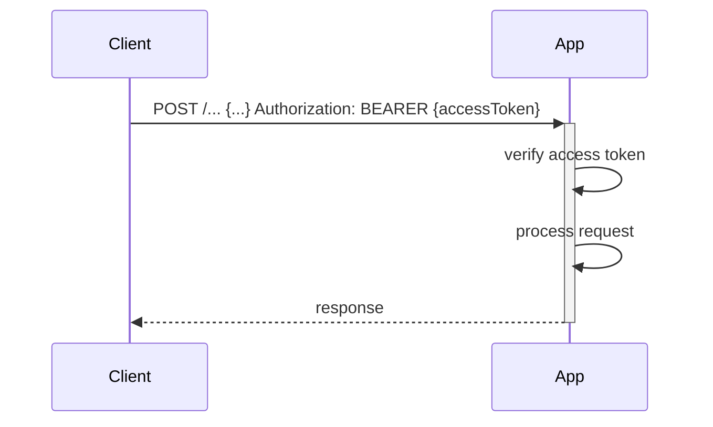
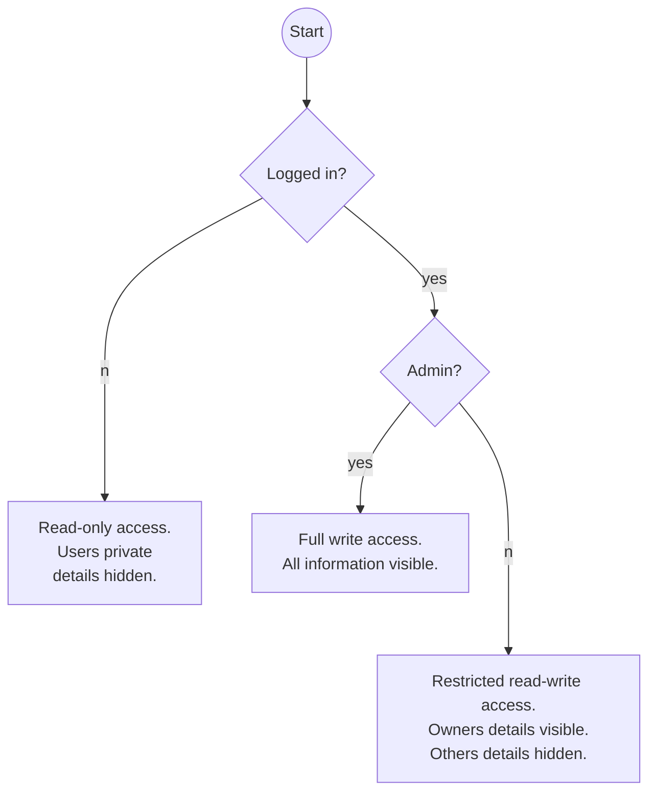

# AUTH

## Auth Server Endpionts
### Sign Up

### Log In

### Log Out

### Refresh

## Application Endpoint

## Roles

## Specific Behaviours

| X      | Admin | Owner | Logged In | Logged Out |
|--------| ----- | ----- | ----------| ---------- |
| Create |      |       |           |            |
| Read   |      |       |           |            |
| Update |      |       |           |            |
| Delete |      |       |           |            |

Just thinking out loud, the above matrix seems to capture all behaviours, but note that
they ar not necessarily hierarchical and can apply differently at entity and field levels.

### Scenarios

These scenarios are raised by considering the demo api as a concrete example. There are
certainly many other situations.

* Logged-out guests may be allowed to browse the api.
* An entity with `auth-role="user"` is maintained by the auth server, it is not
sensible to create such an entity from the api since the `external-id` and `password` are stored
there.
* Staying with the nominated `user` table, the password should never be visible,
except perhaps to the admin user, even though it is a hashed password.
* An `email` field is PPI and should only be visible to the owner and perhaps admin. Furthermore, if
it has the `auth-role="external-id"` attribute it should not be editable by the owner as that
would break the login.
* A comment may refer to a user, a post or another comment. It could be marked as private,
in which case only the owner of the comment and the owner of the entity the comment refers to
should be able to read it.
  * If a comment is private then all replies must be created as private.
  * It's probably non-trivial to toggle the privacy of a comment.
* Deleting an entity should probably not delete other users entities that refer to that entity.
  * So comments may be orphans.