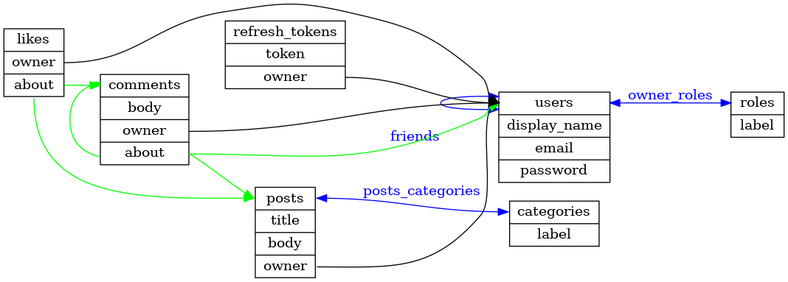

# demo
A demo schema describing a simple social website.

This PNG was generated using the `dot` command from [GraphViz](https://graphviz.org/),
using a`schema.dot` file generated from the `schema.dot.j2` template in the core
`architectures` directory.

References are shown as black arrows, unions as green, and associations as blue.