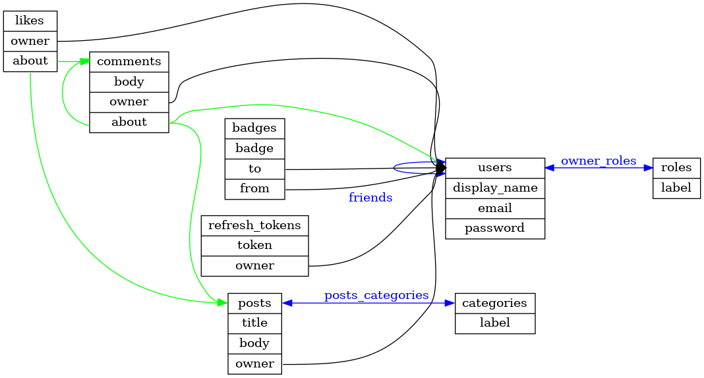

# demo
A demo schema describing a simple social website.

This PNG was generated using the `dot` command from [GraphViz](https://graphviz.org/), in turn using the
`schema.dot.j2` template from the core `architectures` directory.

